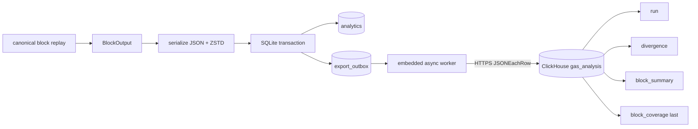

# reth-research - durable ClickHouse export

> Repo: [mattevans/reth](https://github.com/mattevans/reth) · branch: [`feat/research-clickhouse-export`](https://github.com/mattevans/reth/tree/feat/research-clickhouse-export) · compare: [`main...feat/research-clickhouse-export`](https://github.com/mattevans/reth/compare/main...feat/research-clickhouse-export) · pinned commit: [`1f639feed`](https://github.com/mattevans/reth/commit/1f639feed072631a03e84ebf3ae3e49aaedc4697) · last reviewed: **2026-06-10**

## TL;DR

`reth-research` can now export gas-repricing analysis directly to ClickHouse without putting remote I/O in block replay or the SQLite writer critical path.

SQLite remains the local source of truth. Each `(analysis configuration, schedule, block)` output and its export payload are committed atomically, then an embedded worker drains a durable outbox over HTTPS using `JSONEachRow`. Delivery is at-least-once; deterministic IDs, insert deduplication tokens, and `ReplacingMergeTree` make retries idempotent.

The ClickHouse side is already provisioned: the dedicated `gas_analysis` database exists, schema migration `001` has been applied, and the runtime account has read/write permissions scoped to that database. The GitOps migrator is also live under [`gas-analysis-migrator`](https://github.com/ethpandaops/platform/tree/master/environments/staging/applications/gas-analysis-migrator).

| area                        | state                                                                                                                           |
|-----------------------------|---------------------------------------------------------------------------------------------------------------------------------|
| Embedded exporter           | <span class="pill pill-done">done</span>                                                                                        |
| Transactional SQLite outbox | <span class="pill pill-done">done</span> · schema v10                                                                           |
| ClickHouse schema           | <span class="pill pill-done">done</span> · 4 distributed tables + local replicas                                                |
| Database + scoped account   | <span class="pill pill-done">done</span> · `gas_analysis`                                                                       |
| Migrations                  | <span class="pill pill-done">applied</span> · pinned to `1f639feed`                                                             |
| Producer runtime rollout    | <span class="pill pill-todo">not confirmed</span> · configure and start `reth-research` with export enabled (Waiting on Carlos) |

## architecture



The worker inserts one outbox item in this order:

1. `gas_analysis_run`
2. `gas_analysis_divergence`
3. `gas_analysis_block_summary`
4. `gas_analysis_block_coverage`

Coverage is deliberately last. Its presence is the remote completion marker for that schedule/block export. The SQLite outbox row is only marked `exported` after coverage succeeds.

## changes from main

The branch is 8 commits over `main` (`40c4ccc7`) and changes 16 files: roughly 4,418 insertions and 47 deletions.

### export model and deterministic identity

New code under `crates/research/src/export/` defines:

- `AnalysisManifestV1`: deterministic dataset description.
- `ExportEnvelopeV1`: versioned snapshot of one `BlockOutput`.
- typed ClickHouse rows for the four destination tables.
- deterministic export and row IDs using length-prefixed Keccak inputs.
- a versioned nested `trace_payload` for retained forensic components.

`analysis_config_hash = keccak256(manifest_json)`. The manifest includes the producer schema/version, full producer commit, chain ID, replay semantics, normalized gas-limit tiers, drill-in cap, and sorted schedule manifests. Operational settings such as polling interval and backfill concurrency are intentionally excluded.

### SQLite schema v10 and outbox

Two local tables were added:

| table | purpose |
|---|---|
| `analysis_manifests` | immutable manifest JSON keyed by `analysis_config_hash`; lets pending rows survive a restart under a different current CLI config |
| `export_outbox` | compressed block envelope, content hash, retry state, attempts, timestamps, and last error |

The analytical rows and outbox row are written in one SQLite transaction. Payload JSON is serialized, hashed, and ZSTD-compressed at level 3 before the SQLite connection lock is taken.

Outbox states are `pending`, `retry`, `exported`, and `blocked`. Replaying the same deterministic export ID preserves `exported` when the payload hash matches; a changed payload under the same ID resets it to `pending` and logs an invariant warning.

The outbox record contains:

```text
export_id, analysis_config_hash, schedule_name, schedule_config_hash,
block_number, block_hash, payload_version, payload_zstd, payload_hash,
payload_bytes, state, attempts, next_attempt_at, last_error,
created_at, updated_at, exported_at
```

### embedded worker

The worker:

- runs a startup `DESCRIBE TABLE` check for all required producer columns;
- verifies the compressed envelope hash and stored manifest hash before export;
- batches `JSONEachRow` inserts by row count and encoded bytes;
- uses deterministic per-table/chunk insert deduplication tokens;
- retries network errors, timeouts, `408`, `425`, `429`, `5xx`, and auth failures with bounded exponential backoff;
- permanently blocks corrupt payloads, missing manifests, oversized rows, and permanent schema/request errors;
- logs pending count, pending bytes, oldest age, and blocked count;
- stops the process if pending bytes exceed the configured backlog ceiling;
- prunes exported outbox audit rows after the configured retention period.

Remote ClickHouse failure does not block replay or SQLite persistence unless the durable backlog exceeds its configured maximum.

### CLI and startup

Export is optional and disabled unless this flag is provided:

```bash
--research.export-config-path /path/to/clickhouse.toml
```

The config is parsed strictly before node launch. Unknown TOML keys fail startup, HTTPS is required, the database name is identifier-validated, and the password is resolved from an environment variable rather than a CLI argument or config value.

The binary now uses `launch_with_debug_capabilities()`, which also fixes `--dev` operation by installing the debug-capable node components needed to produce blocks.

## ClickHouse data contract

These are analytical records, not Xatu event-ingester events. Every table has a replicated local table and a distributed wrapper; the exporter writes to the unsuffixed distributed table.

| distributed table | row cardinality | purpose |
|---|---|---|
| `gas_analysis_run` | one per deterministic analysis configuration | dataset manifest and producer provenance |
| `gas_analysis_block_coverage` | one per config + schedule + block hash | complete bucket counts and export completion marker |
| `gas_analysis_block_summary` | one per non-empty config + schedule + block + bucket | aggregate gas, opcode, histogram, and state-gas metrics |
| `gas_analysis_divergence` | one per retained drill-in transaction | transaction-level forensic record plus versioned child payload |

All tables use `updated_at` as the `ReplacingMergeTree` version. Block tables partition by `(chain_id, intDiv(block_number, 1000000))`.

### shared identity fields

The block-level rows share these fields:

| field | type | meaning |
|---|---|---|
| `updated_at` | `DateTime` | replacement version / production timestamp |
| `row_id` | `FixedString(66)` | deterministic Keccak identity for the logical row |
| `analysis_config_hash` | `FixedString(66)` | Keccak of canonical `manifest_json` |
| `chain_id` | `UInt64` | replay chain |
| `producer_schema_version` | `UInt32` | local SQLite schema, currently `10` |
| `producer_git_commit` | `String` | full producer git SHA |
| `replay_semantics` | `LowCardinality(String)` | currently `canonical_pre_tx_state` |
| `schedule_name` | `LowCardinality(String)` | schedule identifier |
| `schedule_config_hash` | `FixedString(66)` | Keccak of the schedule fingerprint |
| `block_number` | `UInt64` | canonical block number |
| `block_hash` | `FixedString(66)` | canonical block hash |
| `block_timestamp` | `DateTime` | block timestamp |

Identity derivation:

```text
export_id = keccak(length-prefixed(
  analysis_config_hash,
  schedule_name,
  block_hash,
  "block_output_v1"
))

coverage row  = keccak(export_id, "coverage")
summary row   = keccak(export_id, bucket, "summary")
divergence row = keccak(export_id, tx_index, tx_hash, "divergence")
```

### `gas_analysis_run`

One row identifies the full dataset configuration:

```json
{
  "updated_at": 0,
  "analysis_config_hash": "0x...",
  "chain_id": 1,
  "producer_schema_version": 10,
  "producer_git_commit": "full-git-sha",
  "replay_semantics": "canonical_pre_tx_state",
  "manifest_json": "{...}"
}
```

`manifest_json` has this versioned structure:

```json
{
  "format_version": 1,
  "producer_schema_version": 10,
  "producer_git_commit": "full-git-sha",
  "chain_id": 1,
  "replay_semantics": "canonical_pre_tx_state",
  "gas_limit_multipliers": [1, 2, 4, 8],
  "max_divergences_per_block": null,
  "schedules": [
    {
      "name": "eip-2780",
      "kind": "ExecutionOnly",
      "description": "...",
      "config_fingerprint": "...",
      "config_hash": "0x..."
    }
  ]
}
```

### `gas_analysis_block_coverage`

One row is always emitted per schedule/block, including blocks with no divergence. In addition to the shared fields it contains:

```json
{
  "parent_hash": "0x...",
  "tx_count": 0,
  "tx_count_unchanged": 0,
  "tx_count_trace_only": 0,
  "tx_count_gas_only": 0,
  "tx_count_event_logs_changed": 0,
  "tx_count_schedule_rescued": 0,
  "tx_count_wallet_fixable_shallow": 0,
  "tx_count_wallet_fixable_deep_chain": 0,
  "tx_count_inconclusive_needs_higher_sweep": 0,
  "tx_count_contract_broken": 0,
  "tx_count_aa_gas_reestimation": 0,
  "expected_drill_in_count": 0,
  "retained_drill_in_count": 0,
  "drill_ins_truncated": false
}
```

`expected_drill_in_count` is the sum of `event_logs_changed`, `inconclusive_needs_higher_sweep`, `contract_broken`, and `aa_gas_reestimation`. The retained count may be lower when `--research.max-divergences-per-block` truncates forensic records.

### bucket values

Every transaction is classified into one of these stable strings. All touched buckets receive a summary row; only the four marked drill-in retain transaction-level records.

| bucket | retention |
|---|---|
| `unchanged` | aggregate |
| `trace_only` | aggregate |
| `gas_only` | aggregate |
| `event_logs_changed` | drill-in |
| `schedule_rescued` | aggregate |
| `wallet_fixable_shallow` | aggregate |
| `wallet_fixable_deep_chain` | aggregate |
| `inconclusive_needs_higher_sweep` | drill-in |
| `contract_broken` | drill-in |
| `aa_gas_reestimation` | drill-in |

### `gas_analysis_block_summary`

One row is emitted for each non-empty bucket. Scalar fields are:

```text
bucket, tx_count,
gas_delta_sum, gas_delta_sum_sq, gas_delta_min, gas_delta_max,
state_gas_sum, state_gas_spillover_sum,
tx_count_creation, tx_count_authorization,
tx_count_runtime_state, tx_count_no_state
```

Array fields:

| fields | shape |
|---|---|
| `gas_delta_log2_hist` | 12-bin `Array(Int32)` over `abs(gas_delta)` |
| `multiplier_log2_hist` | 12-bin `Array(Int32)` over minimum successful multiplier |
| `opcode` | sparse opcode bytes |
| `opcode_count` | execution count parallel to `opcode` |
| `opcode_gas_baseline` | baseline gas parallel to `opcode` |
| `opcode_gas_schedule` | schedule gas parallel to `opcode` |

The opcode arrays are equal-length parallel arrays. Only opcodes observed in that block/bucket are included.

### `gas_analysis_divergence`

One row is emitted for each retained drill-in transaction in these buckets:

- `event_logs_changed`
- `inconclusive_needs_higher_sweep`
- `contract_broken`
- `aa_gas_reestimation`

The scalar columns are grouped as follows:

| group | fields |
|---|---|
| transaction | `tx_index`, `tx_hash`, `bucket`, `sender`, `recipient`, `is_create`, `tx_gas_limit` |
| outcome | `baseline_success`, `schedule_success`, `status_changed`, `event_logs_changed`, `output_changed`, `logs_bloom_changed` |
| gas | `baseline_gas_used`, `schedule_gas_used`, `gas_delta`, `baseline_total_gas_spent`, `baseline_gas_refunded`, `schedule_total_gas_spent`, `schedule_gas_refunded`, `schedule_intrinsic_gas`, `schedule_floor_gas`, `would_fit_in_original_limit`, `min_multiplier_to_succeed` |
| divergence location | `divergence_contract`, `divergence_pc`, `divergence_call_depth`, `divergence_opcode` |
| out-of-gas | `oog_contract`, `oog_pc`, `oog_call_depth`, `oog_opcode`, `oog_pattern`, `oog_gas_remaining`, `oog_chain_proportional`, `oog_bottleneck_depth`, `oog_bottleneck_kind` |
| state gas | `schedule_state_gas_spent`, `schedule_state_gas_demanded`, `schedule_initial_state_gas`, `schedule_initial_reservoir`, `runtime_state_gas`, `runtime_state_gas_spillover`, `state_gas_category`, `reservoir_exhausted`, `replay_halt_oog` |
| child payload metadata | `trace_payload`, `trace_content_hash`, `trace_uncompressed_size_bytes`, `trace_format`, `trace_format_version`, `call_frame_count`, `opcode_count_row_count`, `baseline_event_log_count`, `schedule_event_log_count`, `opcode_capture_complete` |

#### `trace_payload`

Call frames, sparse per-frame opcode counts, and event logs are carried as versioned JSON in `trace_payload`. It is explicitly **not** a full step-by-step EVM trace.

```json
{
  "format_version": 1,
  "export_id": "0x...",
  "tx_index": 12,
  "tx_hash": "0x...",
  "call_frames": [
    {
      "call_index": 0,
      "parent_call_index": null,
      "depth": 0,
      "from_address": "0x...",
      "to_address": "0x...",
      "code_address": "0x...",
      "codehash": "0x...",
      "call_type": "CALL",
      "selector": [18, 52, 86, 120],
      "value_wei": "0",
      "gas_provided": 100000,
      "gas_used": 50000,
      "gas_margin": 50000,
      "success": true,
      "parent_gas_at_call": null,
      "gas_requested_on_stack": null,
      "eip150_cap_binding": null,
      "state_gas_running": null,
      "deployed_bytecode_len": null
    }
  ],
  "opcode_counts": [
    {
      "call_index": 0,
      "opcode": 84,
      "count": 2,
      "gas_baseline": 4200,
      "gas_schedule": 8400
    }
  ],
  "baseline_event_logs": [
    {
      "log_index": 0,
      "address": "0x...",
      "topics": ["0x..."],
      "data": "0x..."
    }
  ],
  "schedule_event_logs": []
}
```

Companion columns are:

| field | value |
|---|---|
| `trace_format` | `research_drill_in_components_v1` |
| `trace_format_version` | `1` |
| `trace_content_hash` | Keccak of the uncompressed JSON string |
| `trace_uncompressed_size_bytes` | byte length of the JSON string |
| `call_frame_count` | number of call frame objects |
| `opcode_count_row_count` | number of sparse `(frame, opcode)` rows |
| `baseline_event_log_count` | baseline log count |
| `schedule_event_log_count` | schedule log count |
| `opcode_capture_complete` | `NULL` in v1; the inspector truncation flag is not yet propagated |

## ClickHouse and migrations

The ClickHouse deployment work is complete:

- dedicated database: `gas_analysis`;
- dedicated runtime account with read/write access scoped to `gas_analysis.*`;
- migration `001_gas_analysis.up.sql` applied;
- replicated local tables plus distributed wrappers created on the cluster;
- migration tracking tables live inside `gas_analysis`;
- exporter-facing schema is pinned to reth commit `1f639feed072631a03e84ebf3ae3e49aaedc4697`.

The migrator Helm app is at:

```text
ethpandaops/platform/environments/staging/applications/gas-analysis-migrator
```

It runs as an Argo CD `PreSync` hook:

1. shallow-fetch the pinned reth commit and its migration directory;
2. bootstrap the database and distributed migration tracker if absent;
3. run `golang-migrate up` against `gas_analysis`;
4. block the sync on failure (`backoffLimit: 0`);
5. recreate the stable-name job on the next pinned ref change.

The tracked version `ConfigMap` contains `gitRef` and `migrationsPath`; changing the pinned ref makes the app OutOfSync so self-heal reruns the migration hook.

## runtime configuration

Minimal producer config:

```toml
endpoint = "https://clickhouse.example.org:8443"
database = "gas_analysis"
username = "gas_analysis"
password_env = "CLICKHOUSE_PASSWORD"

request_timeout_secs = 30
poll_interval_ms = 1000
retry_initial_ms = 500
retry_max_secs = 60
max_batch_rows = 1000
max_batch_bytes = 8388608
max_single_row_bytes = 16777216
exported_retention_secs = 604800
max_pending_bytes = 53687091200
```

Start export with an on-disk SQLite database:

```bash
export CLICKHOUSE_PASSWORD='...'

cargo run --release -p reth-research-bin -- node \
  --research.eip2780 \
  --research.db-path ./divergences.sqlite \
  --research.export-config-path ./clickhouse.toml
```

Export is disabled for `:memory:` databases because the outbox must survive process restart.

## operational checks

Useful local outbox inspection:

```sql
SELECT state, count(*) AS rows, sum(payload_bytes) AS bytes
FROM export_outbox
GROUP BY state;

SELECT export_id, block_number, attempts, next_attempt_at, last_error
FROM export_outbox
WHERE state IN ('retry', 'blocked')
ORDER BY updated_at DESC
LIMIT 100;
```

ClickHouse completeness check: coverage is authoritative only after the worker has inserted all other rows for the block.

```sql
SELECT
  schedule_name,
  min(block_number) AS first_block,
  max(block_number) AS last_block,
  count() AS covered_blocks,
  sum(tx_count) AS transactions,
  sum(retained_drill_in_count) AS retained_drill_ins
FROM gas_analysis.gas_analysis_block_coverage FINAL
GROUP BY schedule_name
ORDER BY schedule_name;
```
