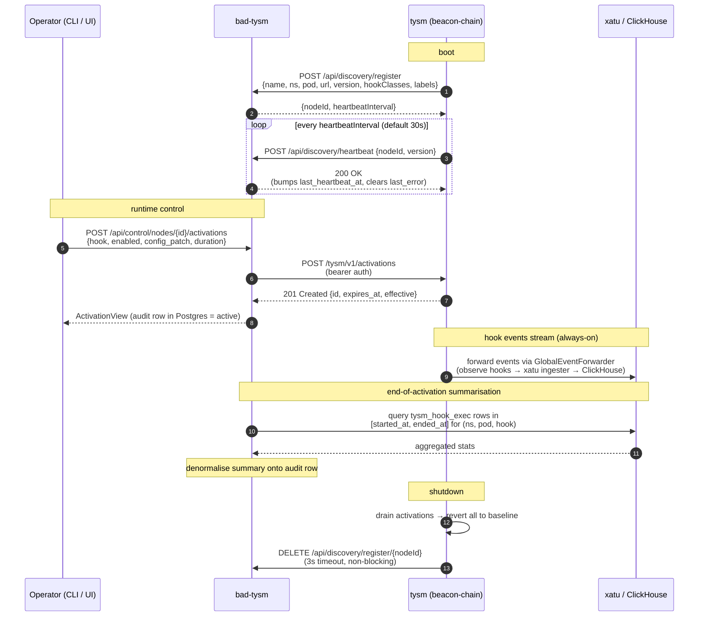

# tysm — hooks + discovery

> Repo: [ethpandaops/tysm](https://github.com/ethpandaops/tysm) · branch: `release/runtime-cfg-hooks` · PR series merged: #18–#31

## TL;DR

Three big additions on this branch:

1. **All new Gloas event publishing** — 7 events emitted to xatu (4 ePBS gossip topics + 3 synthetic lifecycle events). Also Gloas-aware data column sidecar routing.
2. **Runtime hook control HTTP API** — bearer-token-protected `/tysm/v1/*` endpoints to list hooks, inspect current state, and apply TTL-bound activations.
3. **Push-discovery to bad-tysm** — tysm advertises itself on boot, heartbeats, deregisters on shutdown. This is the *only* discovery initiator in this branch — docker label scan and kubernetes discovery live in **bad-tysm**, not here.

| capability | state |
|---|---|
| Gloas event publishing | <span class="pill pill-done">done</span> · verified on kurtosis 2026-05-20 |
| Runtime hook API | <span class="pill pill-done">done</span> · API surface covered below |
| Push-discovery | <span class="pill pill-done">done</span> · reaped on stop |
| Data column mutator (Gloas) | <span class="pill pill-done">done</span> · 5 strategies |

## gloas event publishing

All event forwarding lives in the `xatu` observe hook at `overlay/tysm/hooks/observe/xatu/xatu.go`. Each event is produced by a dispatcher under `overlay/tysm/dispatcher/`, the `xatu` hook subscribes via its `On…Receive` methods, and forwards via the `GlobalEventForwarder` to xatu's ingester.

### 4 ePBS gossip topics

| event | topic | forwarder | dispatcher |
|---|---|---|---|
| `LIBP2P_TRACE_GOSSIPSUB_EXECUTION_PAYLOAD_ENVELOPE` | `execution_payload` | `CreateHermesExecutionPayloadEnvelopeEvent` | `DispatchExecutionPayloadEnvelopeReceive` |
| `LIBP2P_TRACE_GOSSIPSUB_EXECUTION_PAYLOAD_BID` | `execution_payload_bid` | `CreateHermesExecutionPayloadBidEvent` | `DispatchExecutionPayloadBidReceive` |
| `LIBP2P_TRACE_GOSSIPSUB_PAYLOAD_ATTESTATION_MESSAGE` | `payload_attestation_message` | `CreateHermesPayloadAttestationEvent` | `DispatchPayloadAttestationReceive` |
| `LIBP2P_TRACE_GOSSIPSUB_PROPOSER_PREFERENCES` | `proposer_preferences` | `CreateHermesProposerPreferencesEvent` | `DispatchProposerPreferencesReceive` |

### 3 synthetic lifecycle events

These don't exist on beacon-API SSE; they're pure xatu/TYSM constructs because the underlying state transitions don't have a natural beacon-api home.

| event | when it fires | source file |
|---|---|---|
| `BEACON_SYNTHETIC_PAYLOAD_STATUS_RESOLVED` | per slot when fork-choice resolves PENDING → FULL/EMPTY/INVALID, at the PTC deadline | `payload_status_resolver.go`, dispatched via `DispatchPayloadStatusResolved` in `overlay/tysm/dispatcher/epbs_lifecycle.go` |
| `BEACON_SYNTHETIC_BUILDER_PENDING_PAYMENT_SETTLEMENT` | per epoch at settle/drop (`SETTLED` / `DROPPED`) | `epbs_lifecycle.go` → `DispatchBuilderPendingPaymentSettlement` |
| `BEACON_SYNTHETIC_PAYLOAD_ATTESTATION_PROCESSED` | after a PTC vote clears full gossip validation and is committed | dispatcher for `payload_attestation_message` gossip (enrichment counterpart to `LIBP2P_TRACE_GOSSIPSUB_PAYLOAD_ATTESTATION_MESSAGE`, lets you join received-vs-processed) |

All three are observe-only.

### Gloas data column sidecars

`OnDataColumnReceive` detects Gloas-shaped sidecars via `event.IsGloas()` and routes through `CreateHermesBeaconDataColumnSidecarGloasEvent` instead of the Fulu path. Handles the structural difference (Gloas drops the signed block header; adds `slot` + `beacon_block_root`).

There's also a **data column mutator** hook at `overlay/tysm/hooks/mutate/data_column_mutator/` — Gloas-aware, supports 5 mutation strategies, and is `RuntimeReconfigurable` (so its config can be hot-swapped via the hook API below). Use it to exercise the `INVALID` payload-status transition (`BEACON_SYNTHETIC_PAYLOAD_STATUS_RESOLVED` hasn't seen INVALID on devnet yet).

## runtime hook control HTTP API

Server: `overlay/tysm/api/server.go` · handlers: `overlay/tysm/api/handlers.go` · auth: `overlay/tysm/api/auth.go`.

The listener is bound from `tysm.SetupP2P` (not `tysm.Initialize`), so `/healthz` returning 200 guarantees P2P is up and mutator publishers are ready.

### endpoints

| method | path | auth | purpose |
|---|---|---|---|
| `GET`    | `/healthz` | none | liveness; returns `{"status":"ok"}` |
| `GET`    | `/tysm/v1/info` | bearer | build info (listen addr, auth enabled, server time) |
| `GET`    | `/tysm/v1/hooks` | bearer | list all registered hooks with `baseline`, `effective`, and current `activation_id` if any |
| `GET`    | `/tysm/v1/hooks/{name}` | bearer | one hook by name; 404 if unknown |
| `POST`   | `/tysm/v1/activations` | bearer | create a TTL-bound activation (see below) |
| `GET`    | `/tysm/v1/activations` | bearer | list active activations |
| `GET`    | `/tysm/v1/activations/{id}` | bearer | fetch one activation; 404 if unknown or retired |
| `DELETE` | `/tysm/v1/activations/{id}` | bearer | cancel activation, revert hook to baseline. Idempotent, 204 on success |

### activation semantics

Only hooks that implement the `RuntimeReconfigurable` interface can be activated. Today that's **`blob-mutator`** and **`data-column-mutator`** — all others are read-only.

**Request body** for `POST /tysm/v1/activations`:

```json
{
  "hook": "data-column-mutator",
  "duration": "20m",
  "enabled": true,
  "config_patch": { "mutationProbability": 1.0, "enabledStrategies": ["kzg-corruption"] },
  "replace": false
}
```

- At least one of `enabled` or `config_patch` is required.
- `config_patch` is a **shallow top-level overlay** — each top-level key wholly replaces the baseline. Nested objects are not merged.
- `409 Conflict` if an activation already exists and `replace != true`.
- `400` for bad duration, unknown hook, or non-`RuntimeReconfigurable` hook.
- Returns `201 Created` with `{ id, hook, created_at, expires_at, effective }`.

### metrics

Exposed at `/metrics` (Prometheus format):

- `tysm_api_requests_total{route, status}`
- `tysm_api_request_duration_seconds{route}`
- `tysm_api_active_activations`

## discovery

Source: `overlay/tysm/discovery/discovery.go` + `client.go` + `discovery_test.go`. Push-only from tysm's side — tysm announces itself; bad-tysm stores the row and dials back to the runtime API.

### lifecycle

1. **Boot register** — `POST /api/discovery/register` with `{ name, namespace, pod, nodeName, url, version, hookClasses, labels }`. Bad-tysm upserts on `(namespace, pod)` and returns `{ nodeId, heartbeatInterval }`.
2. **Heartbeat loop** — every `heartbeatInterval` (default 30s, overridable from the register response), `POST /api/discovery/heartbeat` with `{ nodeId, version }`.
3. **Deregister** — on `Stop()`, `DELETE /api/discovery/register/{nodeId}` with a 3s timeout. Graceful: doesn't block shutdown if bad-tysm is slow.
4. **Retry** — exponential backoff on failures (1s → 30s max). A failed heartbeat clears the `nodeId` so the next tick re-registers.

### where local / docker / kurtosis / kubernetes discovery actually lives

Important nuance — tysm only does push-registration. The receiving side (bad-tysm) implements the *passive* discovery modes:

| environment | discovery mode | where it's configured |
|---|---|---|
| **kubernetes** | push from tysm pods; bad-tysm reaps when heartbeat stops | tysm-side: `discovery:` config block (this page). bad-tysm: nothing special |
| **kurtosis / docker compose** | docker label scan in bad-tysm sees containers labelled `ethpandaops/tysm`; spawns `alpine/socat` sidecars to forward the container's API port to a stable host port | bad-tysm env: `BADTYSM_DISCOVERY_DOCKER_ENABLED=true`, `BADTYSM_DISCOVERY_DOCKER_HOST_MODE=true` |
| **local (single binary)** | either push (set `discovery.enabled: true` + point at a local bad-tysm) or manual UI registration | up to you |

The push-discovery requires `api.enabled: true` because bad-tysm dials the `self_url` to reach the runtime API.

## config example

From `overlay/config/tysm-hook-config-example.yaml` — copy this, fill in the env vars, and you're running. (`${ENV_VAR}` references are resolved at boot.)

```yaml
api:
  enabled: true
  listen: "127.0.0.1:8080"
  auth_token: "${TYSM_API_TOKEN}"
  max_activation_duration: "4h"
  instance_id: ""

discovery:
  enabled: true
  bad_tysm_url: "http://bad-tysm.observability.svc:8666"
  auth_token: "${TYSM_TOKEN}"
  self_url: "${TYSM_SELF_URL}"
  name: "${POD_NAME}"
  namespace: "${POD_NAMESPACE}"
  pod: "${POD_NAME}"
  node_name: "${NODE_NAME}"
  heartbeat_interval: "30s"
  labels: {}
```

## how tysm and bad-tysm interact



**Reading the diagram:**

- All registration traffic is **tysm → bad-tysm** (push). Bad-tysm never proactively probes for new tysm pods over a network.
- All hook control traffic is **bad-tysm → tysm** (pull, via the runtime API). The operator's request is proxied through bad-tysm so the audit row is recorded.
- Event data flows independently — tysm forwards directly to xatu / ClickHouse. Bad-tysm reads from ClickHouse at end-of-activation to enrich the audit row with what happened during the window.
- On stale heartbeat (default ~90s in bad-tysm), the node row is *marked* (`last_error = "stale: no heartbeat for 90s"`) but **never deleted** — FKs from activations are preserved. The reaper + healthcheck loops both skip stale rows to avoid probing URLs that may have been reassigned.

## build + run

### build (local)

```bash
# from your local clone of ethpandaops/tysm
./scripts/tysm-build.sh -r OffchainLabs/prysm -b develop
# output: prysm/build/beacon-chain, prysm/build/validator
```

Key scripts:
- `scripts/tysm-build.sh` — orchestrator (clone → patch → build)
- `scripts/apply-tysm-patch.sh` — apply patches + overlay to existing clone
- `scripts/update-deps.sh` — pin xatu, ethcore, ethwallclock

### docker

```bash
./scripts/tysm-build.sh -r OffchainLabs/prysm -b develop --skip-build
cd prysm
docker build -f ../ci/Dockerfile.beacon -t ethpandaops/tysm:latest .
docker build -f ../ci/Dockerfile.validator -t ethpandaops/tysm-validator:latest .
```

Also `build-docker.sh` at the repo root for a one-liner that wraps the above.

### run with API + discovery enabled

```bash
# env (one shell, set before running)
export TYSM_API_TOKEN="dev"
export TYSM_TOKEN="dev"
export TYSM_SELF_URL="http://127.0.0.1:8675"
export POD_NAME="local-tysm"
export POD_NAMESPACE="default"

# config: copy overlay/config/tysm-hook-config-example.yaml,
# set api.enabled: true and discovery.enabled: true
./prysm/build/beacon-chain \
  --tysm-hook-config-file /path/to/hook-config.yaml \
  --mainnet \
  # ... rest of normal beacon-chain flags
```

### exercise the API

```bash
TOKEN=dev BASE=http://localhost:8080

# wait until ready
until curl -fs $BASE/healthz >/dev/null; do sleep 1; done

# list hooks
curl -H "Authorization: Bearer $TOKEN" $BASE/tysm/v1/hooks | jq

# activate blob-mutator for 2m
curl -H "Authorization: Bearer $TOKEN" -X POST $BASE/tysm/v1/activations \
  -H "Content-Type: application/json" \
  -d '{
    "hook":"blob-mutator",
    "enabled":true,
    "config_patch":{"mutationProbability":1.0,"enabledStrategies":["kzg-corruption"]},
    "duration":"2m"
  }' | jq
```

For the full devnet config (Kurtosis + xatu + bad-tysm side by side) see the **[kurtosis devnet](#/kurtosis)** page.

## key files to start reading

| area | file |
|---|---|
| Gloas event publishing | `overlay/tysm/hooks/observe/xatu/xatu.go` |
| Dispatchers | `overlay/tysm/dispatcher/epbs_*.go` |
| Payload status resolver | `overlay/tysm/payload_status_resolver.go` |
| Data column mutator | `overlay/tysm/hooks/mutate/data_column_mutator/` |
| API server | `overlay/tysm/api/server.go` |
| API handlers | `overlay/tysm/api/handlers.go` |
| Discovery client | `overlay/tysm/discovery/discovery.go`, `client.go` |
| Config schema | `overlay/config/tysm-hook-config-example.yaml` |
| Xatu integration config | `overlay/config/xatu-config-example.yaml` |
